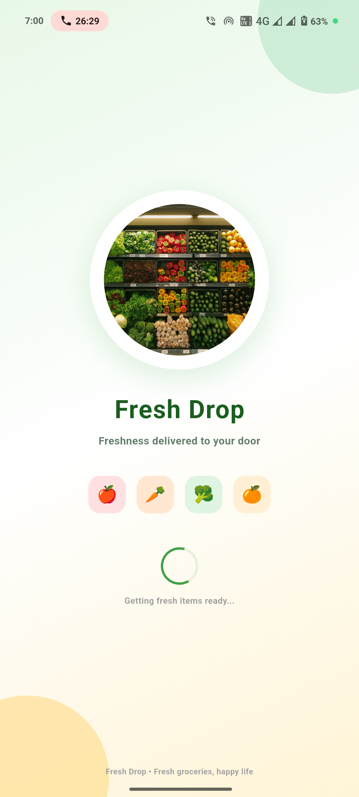
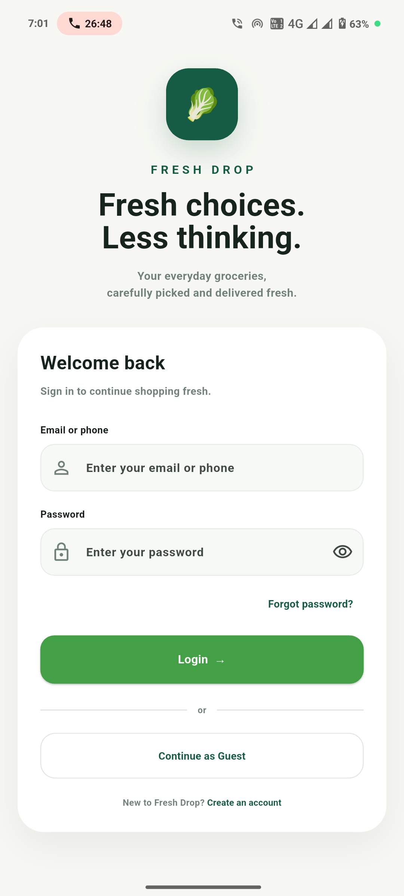
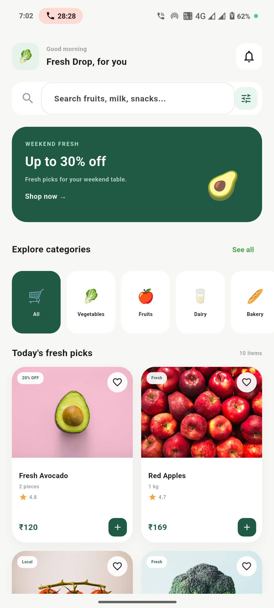

# Fresh Drop – Grocery Shopping App

A modern, responsive grocery shopping application built with **Flutter**. Fresh Drop provides a clean and user-friendly shopping experience with product browsing, categories, search, login screen.

This project was developed as a Flutter development task and focuses on creating an attractive UI, reusable components, smooth navigation, and maintainable Flutter code.

---

## Project Overview

**Fresh Drop** is a grocery shopping application designed to make it easy for users to:

* Browse grocery products
* Explore products by category
* Search for products
* Login using email or phone
* Create a new account
* Continue as a guest
* Navigate between major sections using bottom navigation

The application currently uses **mock/static product data**, so no backend or external database is required to run the project.

---

## Features

### Authentication

* Login screen
* Email/phone input
* Password validation
* Form validation
* Error messages
* Loading state during login
* Create account navigation
* Guest access option

### Home Screen

* Welcome/header section
* Search functionality
* Grocery categories
* Promotional banner
* Popular products
* Product cards
* Product image, name and price

### Categories

* Browse grocery categories
* Category-based product filtering
* Dedicated category screen
* Easy navigation between categories

### Search & Filtering

* Search products by name
* Filter products by category
* Dynamic product list updates
* Clear and simple search interface


### Product Details

* Product image
* Product name
* Product price
* Product description
* Product category


### Navigation

The application uses a bottom navigation system for quick access to:

* Home
* Categories
---

## Technologies Used

| Technology       | Purpose                  |
| ---------------- | ------------------------ |
| Flutter          | Application development  |
| Dart             | Programming language     |
| Material 3       | UI components and design |
| Provider         | State management         |
| Firebase/Backend | Not required             |
| Mock Data        | Product/category data    |

---

## Requirements

Before running the project, make sure you have the following installed:

* Flutter SDK
* Dart SDK
* Android Studio or VS Code
* Android Emulator or physical Android device
* Git (optional)

You can verify your Flutter installation using:

```
flutter doctor
```

Make sure there are no critical issues reported by Flutter Doctor.

---

## Getting Started

### 1. Clone the Repository

Clone the project using Git:

```
git clone <YOUR_GITHUB_REPOSITORY_URL>
```

Navigate into the project directory:


cd fresh drop

If you received the project as a ZIP file, extract it and open the extracted project folder instead.


### 2. Install Dependencies

Run:


flutter pub get


This installs all packages required by the project.

The project uses the `provider` package for state management.

Example dependency:

```yaml
dependencies:
  flutter:
    sdk: flutter

  provider: ^6.1.2
```

---

### 3. Check Connected Devices

Run:

```
flutter devices
```

You should see an available Android emulator, physical Android device, or another supported Flutter device.

---

### 4. Run the Application

Start the application using:

```
flutter run
```

You can also select a specific device:

```
flutter run -d <device_id>
```

For example:

```
flutter run -d emulator-5554
```

---

## Project Structure

The project follows a modular structure to keep the code clean and maintainable.

```text
lib/
│
├── main.dart
│
├── models/
│   ├── product.dart
│   ├── category.dart
│   
│
├── screens/
│   ├── splash_screen.dart
│   ├── login_screen.dart
│   ├── signup_screen.dart
│   ├── home_screen.dart
│   ├── category_screen.dart
│
├── widgets/
│   ├── product_card.dart
│   ├── category_card.dart
│   ├── search_bar.dart
│   ├── offer_banner.dart
│   ├── basket_card.dart
│   └── bottom_nav.dart
│
├── providers/
│   ├── product_provider.dart
│   
│
├── data/
│   └── mock_products.dart
│
└── theme/
    └── app_theme.dart
```

---

##  Folder Responsibilities

### `models/`

Contains the application's data models.

Examples:

* `Product` – Product information
* `GroceryCategory` – Category information
---

### `screens/`

Contains complete application screens.

Examples:

* Splash screen
* Login screen
* Signup screen
* Home screen
* Category screen
* Product details
---

### `widgets/`

Contains reusable UI components.

Examples:

* Product cards
* Category cards
* Search bar
* Promotional banner
* Bottom navigation

Reusable widgets help avoid duplicated UI code.

---

### `providers/`

Contains application state management using **Provider**.

#### `ProductProvider`

Responsible for:

* Product data
* Search
* Category filtering

### `data/`

Contains mock/static application data.

The application can run without a backend because grocery products and categories are currently provided through mock data.

---

### `theme/`

Contains the application's common theme and colors.

This helps maintain consistent:

* Colors
* Typography
* Button styles
* Material components
* Overall visual appearance

---

## Application Flow

The basic application flow is:

```text
Splash Screen
      │
      ▼
Login Screen
      │
      ├──────────────► Create Account
      │
      ├──────────────► Continue as Guest
      │
      ▼
Home Screen
      │
      ├── Categories
      │      └── Category Products
      │
      ├── Search
      │
      ├── Product
      │      └── Product Details
      

---

##  UI & Design

The application follows a clean grocery-shopping visual style.

The design focuses on:

* Clean layouts
* Rounded cards
* Grocery product imagery
* Green-based branding
* Clear typography
* Consistent spacing
* Responsive layouts
* Reusable components
* Simple navigation
* User-friendly interactions

The primary brand color used throughout the application is based around:

```text
#165B43
```

---

## State Management

The application uses the **Provider** package for state management.

Providers are registered in `main.dart` using `MultiProvider`.

Example:

```
MultiProvider(
  providers: [
    ChangeNotifierProvider(
      create: (_) => ProductProvider(),
    ),
 
  ],
  child: const MyApp(),
);
```

This allows different screens and widgets to access and update application state without manually passing data through multiple widget levels.

---

## Testing the Application

After running the application, test the following flows:

### Authentication

* Enter an invalid email/phone
* Enter an invalid password
* Verify validation messages
* Try valid login information
* Try the Create Account button
* Try Guest access

### Products

* Browse products
* Open a product
* View product details

### Search

* Search for an existing product
* Search for a product that does not exist
* Clear the search

### Categories

* Open Categories
* Select a category
* Verify that products are filtered correctly

### Navigation

Check navigation between:

```
Home
Categories
```

## Possible Future Improvements

The application can be extended with:

* Firebase Authentication
* Firestore product database
* Real-time cart synchronization
* User registration
* User profile management
* Online payment integration
* Order history
* Order tracking
* Address management
* Product reviews and ratings
* Push notifications
* Real-time inventory
* Product pagination/API-based infinite scrolling
* Dark mode
* Coupon and discount system

---

## Build APK

To generate a release APK:

```
flutter build apk --release
```

The generated APK will normally be available at:

```text
build/app/outputs/flutter-apk/app-release.apk
```

For a smaller architecture-specific APK, you can use:

```
flutter build apk --split-per-abi
```

---

## Build for Other Platforms

### Android

```
flutter build apk
```

### Web

```
flutter build web
```

### Windows

```
flutter build windows
```

Other platforms can be built depending on the Flutter environment and platform configuration.

---

## Code Formatting

Format the entire project using:

```
dart format .
```

You can also analyze the project with:

```
flutter analyze
```

---

## Troubleshooting

### Dependency errors

Run:

```
flutter clean
flutter pub get
```

Then run:

```
flutter run
```

### Build errors

Try:

```
flutter clean
flutter pub get
flutter doctor
```

Then rebuild the application.

### Images not loading

The current mock products may use remote image URLs. Make sure the device/emulator has an active internet connection when remote images are used.

---

## Important Notes

* This is a Flutter UI-focused grocery shopping application.
* Product information is currently based on mock/static data.
* No production payment system is implemented.
* No production authentication system is implemented.
* The application is intended for demonstration/development purposes.
* Replace mock data with an API or database when moving toward production.

---

## Development

### Main Technologies

```
Flutter
Dart
Material 3
Provider
```

### Architecture

```text
UI Screens
    ↓
Reusable Widgets
    ↓
Providers
    ↓
Models
    ↓
Mock Data
```

This structure keeps UI, state management, data models, and mock data separated, making the project easier to maintain and extend.


## Acknowledgements

Built with Flutter and Dart as a modern grocery shopping application concept.

**Fresh Drop – Fresh groceries, simple shopping.**

## App Screenshots

### Splash Screen



### Login Screen



### Home Screen


